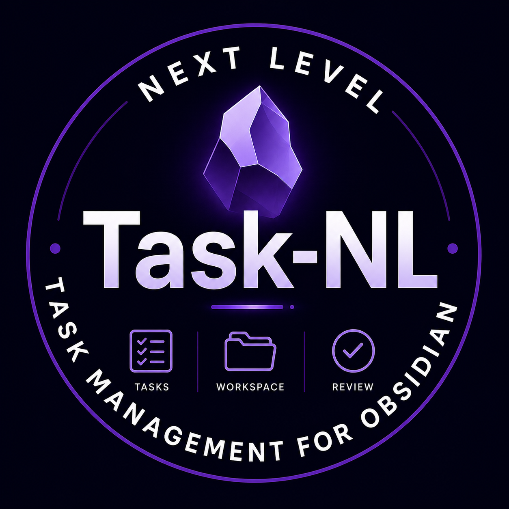

<div align="center">
  
</div>

Tasks NL lets you write tasks naturally in Dutch while producing clean, standardized Markdown compatible with the Obsidian Tasks ecosystem.

---

## Features

- 🇳🇱 Natural Dutch task entry
- 📅 Automatic date recognition
- 🔁 Recurring tasks
- 👥 Projects and people
- 📋 Sequential subtasks
- 🖥 GTD Workspace
- 📖 Weekly and monthly reviews
- ✏️ Visual task editor
- ⚡ Works with standard Markdown

---

## Workspace

Tasks NL provides a GTD-inspired Workspace with:

- Inbox
- Actual
- This week
- 7+ days
- Waiting
- Someday
- Review

All tasks remain normal Markdown tasks.

---

## Reviews

Tasks NL can create:

- Weekly Review
- Monthly Review

Review notes are generated as Markdown files inside your vault.

The layout, filename and location are configurable.

---

## Natural Dutch

Examples

```
morgen Peter bellen hoog CRM
```

becomes

```
- [ ] Peter bellen 📅 2026-07-13 🔥 high +CRM
```

---

## Philosophy

Write naturally.

Store consistently.

Markdown is the source of truth.

---

## Installation

### BRAT (recommended)

Instructions will follow after the first public release.

### Manual

Copy

- manifest.json
- main.js
- styles.css

to

```
Vault/.obsidian/plugins/tasks-nl/
```

Restart Obsidian.

---

## Roadmap

See

ROADMAP.md

---

## Contributing

Bug reports and ideas are always welcome.

Please create an Issue before submitting larger Pull Requests.

---

## Support

If Tasks NL saves you time and helps you stay organized, you can support future development.

❤️ Buy me a coffee

[Link](https://buymeacoffee.com/joostvanderhulst)

---

## License

Tasks NL is released under the MIT License.

See the LICENSE file for details.


---

## Inspiration

This plugin is inspired by the Obsidian Community Plugin **Tasks**.

Tasks NL can operate completely independently, but it can also be used alongside the Community Tasks plugin. It uses the same task syntax and icons to maximize compatibility.

Icons used (Tasks syntax):

- 📅 Due date
- ✅ Completion date
- 🔁 Recurrence
- 🏁 On completion (`delete` / `keep`)
- ⏫ ⏬ 🔼 Priority (when used)

This keeps Markdown files readable and compatible with both plugins.


## Acknowledgements

Tasks NL is inspired by the excellent **Tasks Community Plugin** for Obsidian.

Tasks NL is an independent project that can operate completely on its own and does not require the Tasks Community Plugin. At the same time, it is fully compatible with the Tasks task format and can also be used alongside the Tasks plugin without conflicts.

To maximize compatibility, Tasks NL uses the same task syntax and icons where applicable, including:

- 📅 Due Date
- ✅ Completion Date
- 🔁 Recurrence
- 🏁 On Completion (`delete` / `keep`)
- ⏫ High Priority
- 🔼 Medium Priority
- 🔽 Low Priority

This compatibility allows users to migrate between both plugins or use them together while keeping their Markdown task files fully compatible.

**Tasks** is an official Obsidian Community Plugin. All credit for the original task format, syntax and concepts belongs to the Tasks project and its contributors. Tasks NL is an independent project inspired by the Tasks plugin and designed to be compatible with its task format.

