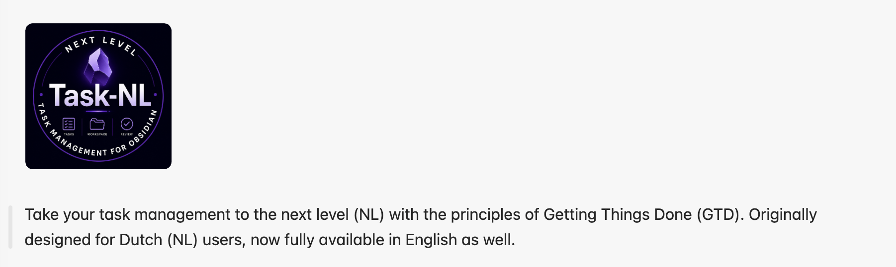
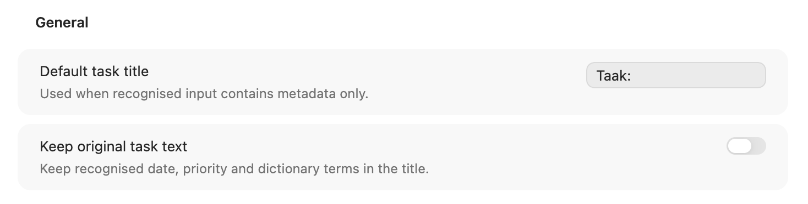
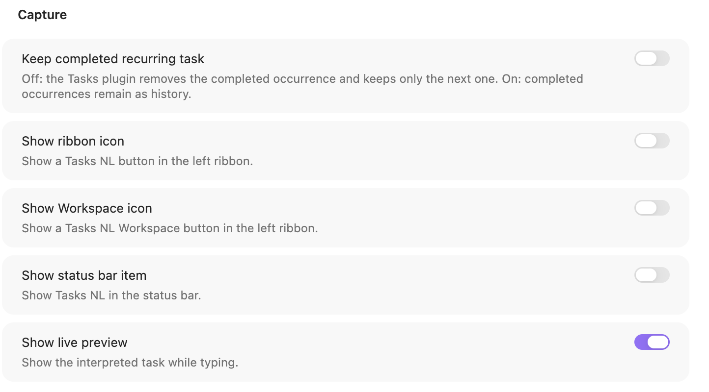
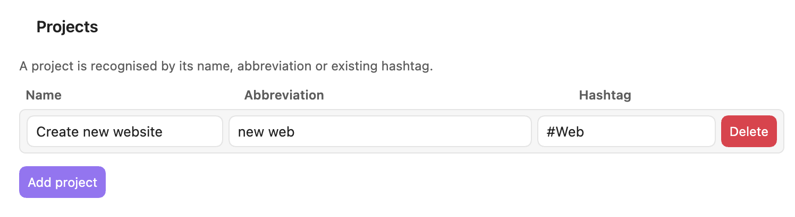
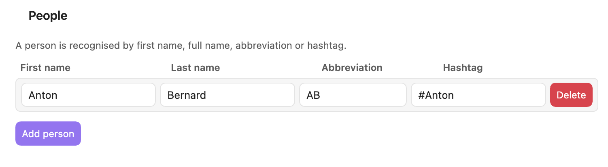

**Language:** [English](README_manual_ENG.md) · [Nederlands](README_manual_nl.md)

<div align="center">
  
</div>

# Tasks NL

Tasks NL lets you capture tasks in natural Dutch, stores them as standard Markdown tasks, and presents them in a GTD-oriented Workspace. The settings interface is available in **NL — Nederlands** and **ENG — English**.

## Highlights

- Natural-language capture for dates, priorities, recurrence, projects, people, and GTD terms.
- Standard Markdown task lines; your vault remains the source of truth.
- GTD Workspace with Inbox, current tasks, this week, later, Waiting For, Someday, and Review.
- Focus positions **1, 2, and 3** without adding tags; focused tasks stay in place and share one subtle highlight colour.
- Up to two people per task, both visible in the Workspace.
- Configurable recurrence phrases mapped to English Tasks syntax, including singular and plural intervals such as `elke week`, `elke twee weken`, `elke maand`, and `elke drie maanden`.
- Desktop, iPad, and phone layouts.

## Workspace


Tasks remain in their normal Workspace section. A focus value of 1, 2, or 3 can be assigned directly from the task row. Each number can be used by one task at a time, and no focus hashtag is added.

## Settings language

Choose **NL — Nederlands** or **ENG — English** at the top of **Settings → Community plugins → Tasks NL**. This translates the settings labels and explanations. Recognition phrases remain independently configurable.



## Configurable recurrence

Each recurrence definition contains:

1. the phrase you type, for example `elke twee weken`;
2. the English Tasks instruction, for example `every 2 weeks`.

Both singular and plural week/month expressions are recognised. You can also add English or other custom phrases.



## Projects and people

Project and person definitions map natural wording to hashtags. A task may contain at most two configured people; both are displayed in the Workspace.





## Task capture and editing


## Installation

### Community Plugins

After publication, install Tasks NL from **Settings → Community plugins → Browse**.

### BRAT

Before publication, add the GitHub repository through BRAT and select the latest release.

### Manual installation

Copy `main.js`, `manifest.json`, and `styles.css` into:

```text
<Vault>/.obsidian/plugins/tasks-nl/
```

Restart Obsidian, then enable **Tasks NL** under Community plugins.

## Documentation

- [English manual](README_manual_ENG.md)
- [Nederlandse handleiding](README_manual_nl.md)
- [Architecture](doc/Architecture.md)
- [Roadmap](doc/ROADMAP.md)
- [Contributing](assets/Contributing.md)

## Release files

A GitHub release for version `1.0.0` must contain these files as individual assets:

- `main.js`
- `manifest.json`
- `styles.css`

The GitHub tag must exactly match the version in `manifest.json`: `1.0.0`.

## Privacy and network use

Tasks NL reads and updates Markdown files in the active vault to provide its task features. The plugin does not require an external service and does not send vault content over the network.

## Compatibility

- Minimum Obsidian version: **1.8.7**
- Desktop and mobile: supported
- Tasks NL can operate independently and uses familiar task metadata syntax for compatibility with the Obsidian Tasks ecosystem.

## Support

Bug reports and feature requests are welcome through GitHub Issues.

## License

Tasks NL is released under the [MIT License](LICENSE).
