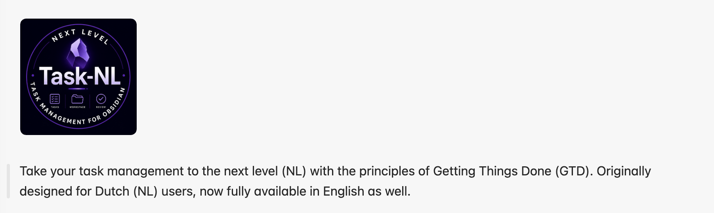
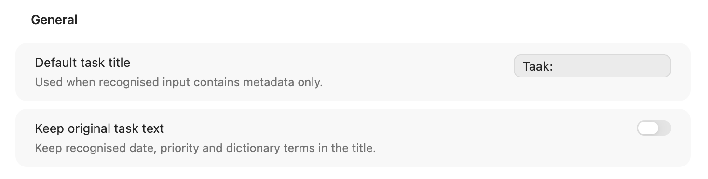
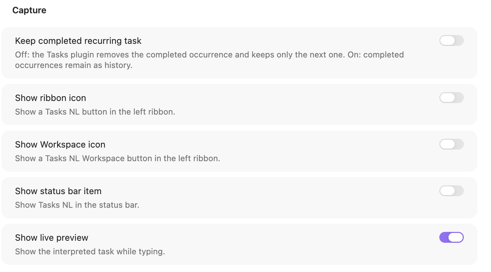
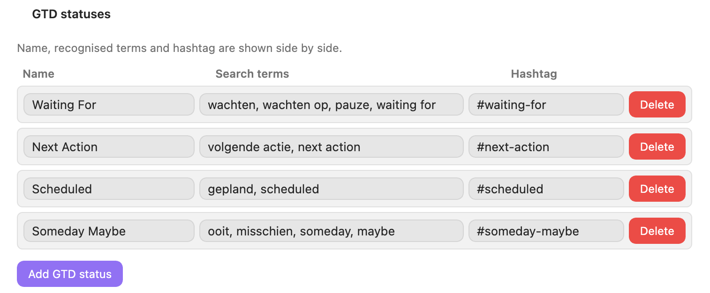
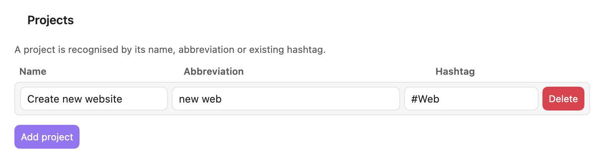
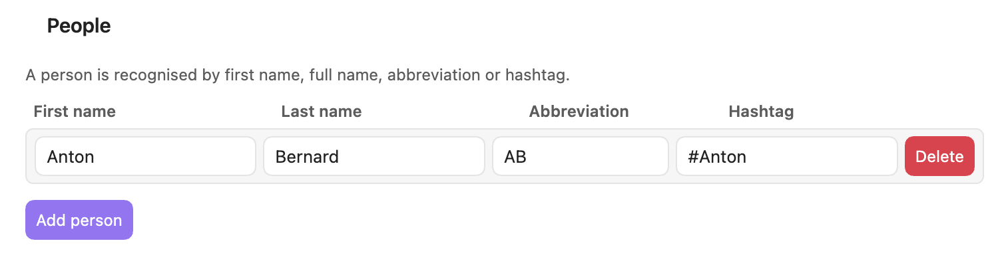
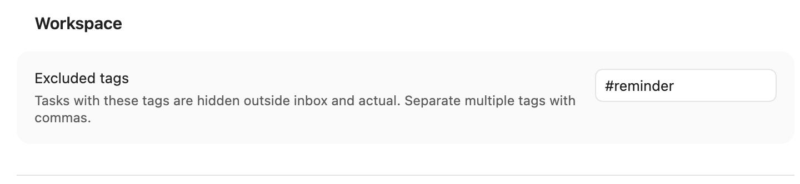

**Taal:** [Nederlands](README_manual_nl.md) · [English](README_manual_ENG.md)

<div align="center">
  

## Synchronising settings

Tasks NL stores settings in Obsidian’s standard plugin file:

```text
<Vault>/.obsidian/plugins/tasks-nl/data.json
```

When using Obsidian Sync, enable community plugins and plugin settings under **Settings → Sync → Vault configuration sync** on **every device**. Wait for sync to finish, fully quit Obsidian, and restart the app. This is especially important on iPhone and iPad.

See the [Obsidian Sync settings guide](https://obsidian.md/help/sync/settings).

Tasks NL does not create a visible settings file among your notes.
</div>

## New in 1.5.0

- Add an optional start date only with configurable phrases such as `start op` and `vanaf`. The Workspace hides this technical date; Actuals uses the start-to-due period.
- Enter recurrence phrases as a free comma-separated list; Dutch, English, and other alternatives are supported.
- Automatically create a daily journal at startup or reload. Folder, filename, properties, and Markdown are configurable; focus 1–3 and next-project steps can be included with two checkboxes.
- Every newly created daily, weekly, or monthly document opens immediately.
- Daily-journal content and properties now remain saved after subsequent edits and reloads.
- Only tasks marked `#tasks-nl-review`, such as weekly and monthly reviews, appear in the Workspace Review section.
- The formats screen is grouped into creation and schedule, file, and content; all explanations and weekdays follow the selected settings language.
- Manually flag one next task per project beside focus positions 1–3. Choosing another task in the same project moves the flag.
- The additional flag column is responsive on desktop, tablet, and phone.

# Tasks NL – English Manual

This manual describes Tasks NL version 1.5.0 for Obsidian. The plugin lets you enter tasks using natural Dutch language, stores them as regular Markdown tasks, and displays them in a GTD-oriented Workspace.

## 1. General workflow

Tasks NL uses your Markdown files as its source. A task therefore remains a normal Markdown line, for example:

```markdown
- [ ] Call Peter 📅 2026-07-13 🔥 high #Pweb
```

A typical workflow is:

1. Open **Create or edit task** from the Command Palette or the ribbon.
2. Enter the task in natural language.
3. Check the live preview when needed.
4. Save the task in the active file.
5. Use the Workspace to view tasks by status, date, project, or person.
6. Create a weekly or monthly review at regular intervals.

Tasks NL recognises dates, priorities, recurrence, projects, people, and GTD terms. The exact interpretation also depends on the definitions configured in the settings.

## 2. Settings



Open **Settings → Community plugins → Tasks NL**. The settings screen is divided into several sections.

### Language

At the top of the settings, choose **NL — Nederlands** or **ENG — English**. This translates the explanations and labels in the settings screen. The selected language does not alter existing tasks and is independent of the recognition phrases you configure.


### General

**Default task title**

The default title used when no usable task title has been entered.

**Keep original task text**

Preserves the original input text alongside or inside the resulting task. Enable this option when you want to retain exactly what you typed.

**Keep completed recurring task**

Keeps the completed occurrence of a recurring task when the next occurrence is created. When disabled, the new open occurrence remains the main relevant task.

**Show ribbon icon**

Displays a Tasks NL button in Obsidian’s left ribbon.

**Show Workspace icon**

Displays a separate button for the Tasks NL Workspace in the left ribbon.

**Show status bar item**

Displays Tasks NL in Obsidian’s status bar.

### Capture



This section manages the dictionaries used to interpret natural-language input.

**Recurrence fields**

A recurrence command consists of a recognised input phrase and its corresponding English Tasks instruction. You can therefore add Dutch, English, or other wording yourself. Singular and plural periods are supported, including `elke week`, `elke twee weken`, `elke maand`, and `elke drie maanden`. The generated output uses English Tasks syntax, such as `every 2 weeks`.


**GTD definitions**



Links a label and synonyms to a hashtag, for example Waiting For or Someday. Synonyms allow different phrases to produce the same classification.

**Project definitions**



Defines a project name, alias, and hashtag. A recognised project can therefore be stored as a consistent hashtag in the task.

**Person definitions**



Defines a first name, last name, alias, and hashtag. This allows people to be recognised in natural-language input and used as filters in the Workspace.

Use unique aliases and hashtags to prevent ambiguous recognition.

### Day, week, and month formats

At the top of Settings there are two main tabs: **General** and **Day, week and month formats**. The formats screen uses the order **Day**, **Week**, **Month** and groups fields into **Creation and schedule**, **File**, and **Content**. Each tab has YAML properties and Markdown fields. Properties are written into one frontmatter block or merged with existing frontmatter, without a Markdown heading. Both fields are saved while typing and remain stored after subsequent edits or reloads. Known codes support single or double braces, for example `{DATE}` and `{{DATE}}`; other braces and code blocks remain unchanged. A journal that has already been created is never overwritten. The daily journal defaults to `Kalender/Dagjournaal` and `dddd DD-MMM-YY`, for example `woensdag 05-aug-26.md`. The focus 1–3 and next-project-step switches insert or remove live DataviewJS code in the Markdown template and update the preview immediately. Only tasks marked `#tasks-nl-review` appear in Review.

**Automatic creation**

For daily journals, Tasks NL checks once at startup or reload whether today's file already exists. Weekly and monthly reviews use the selected weekday.

**Include top 1, 2 and 3 / Include next project steps**

These two switches independently insert actual DataviewJS code blocks into the Markdown template. With **Yes**, the code block is present in the template and its result appears in the preview; with **No**, it is removed completely. In the daily journal, focus tasks are clearly marked with **1**, **2**, or **3**, and next project steps with a flag. The recognition marker lives inside the executed DataviewJS block, so Live Preview shows no separate grey management lines, list bullets, or list accents. Automatic and manual creation synchronize the template immediately before writing the file. Whenever the daily journal is opened, the code queries focus tasks 1–3 or marked next project steps again. The off → on → off → on sequence can be repeated safely without duplicate code blocks.

**Properties**

Free YAML properties without the surrounding `---`. Template variables are supported here too.

**Weekday**

Determines the day on which automatic reviews are created. For a monthly review, the last selected weekday of the month is used.

**Folder in vault**

The folder in which the review file is stored. Weekly and monthly reviews may use the same folder.

**Filename format**

Defines the filename using Moment-style formatting. Place literal text between square brackets.

**Main task**

The main task inserted into the review document. Use `{{FILENAME}}` to insert the generated filename.

**Subtasks, one per line**

The default subtasks for the review process. Each line becomes a separate Markdown subtask.

**Markdown template**

The full contents of the review note. You can include fixed text, headings, and placeholders.

### Preview

**Show live preview**

Shows how Tasks NL interprets the input and how it will be stored as Markdown. This is useful for checking date, priority, and hashtag recognition.

### Workspace

**Excluded tags**



A comma-separated list of hashtags whose tasks are normally hidden, for example:

```text
#reminder, #birthday, #holiday-idea
```

The **Hidden** button in the Workspace displays these hidden tasks. Tasks are grouped under headings based on the matching excluded hashtag. The hashtag headings are sorted alphabetically, and tasks inside each group use the normal Workspace sorting. Hidden review subtasks are not shown in this overview.

## 3. Creating a new task


Run **Tasks NL: Create or edit task** while the cursor is not positioned on an existing task.

1. Enter the task description in the input field.
2. Use natural-language terms for a date, priority, person, project, or recurrence.
3. Check **Preview** when live preview is enabled.
4. Select an explicit due date under **Due date** when required.
5. Add subtasks, one per line.
6. Confirm to insert the Markdown task into the active file.

Example:

```text
Call tomorrow Peter high new website
```

may be converted to:

```markdown
- [ ] Call Peter 📅 2026-07-13 🔥 high #Pweb
```

The exact output depends on your dictionaries and settings.

## 4. Editing a task


Place the cursor on an existing Markdown task and run **Create or edit task**.

The dialog reads the existing task, including its title, date, priority, recurrence, hashtags, and any subtasks.

- Change the text or any explicit fields.
- Check the preview.
- Existing subtasks are displayed under **Existing subtasks**.
- Save to replace the original task line.

For tasks with a source file, Tasks NL opens or updates the task in that original Markdown file. Markdown remains the source of truth, so all changes remain readable without the plugin.

## 5. Workspace


Run **Tasks NL: Open workspace** or use the Workspace ribbon icon.

### Top bar

The top bar contains:

- a button for creating a review;
- a button for opening the Tasks NL settings;
- navigation buttons for the main sections;
- a search field;
- a project filter;
- a person filter;
- the **Hidden** button.

### Sections

**Review**

Open review tasks containing the `#tasks-nl-review` hashtag.

**Inbox**

Open tasks without a due date and without a Waiting For or Someday status. Project and person tags do not exclude a task from Inbox.

**Actual**

Open tasks with a due date up to and including tomorrow.

**This week**

Open tasks from the day after tomorrow through the next seven days.

**7+ days**

Open tasks with a due date more than seven days in the future.

**Waiting For**

Tasks containing the configured GTD hashtag or a classification derived from it.

**Someday**

Tasks marked as Someday through the configured GTD definition.

A task may appear in more than one relevant section. For example, a dated task with Waiting For status may appear both in a date section and under Waiting For.

### Focus 1, 2, and 3

Each task row contains a small focus button. Use it to assign positions **1**, **2**, or **3** to up to three active tasks. Each position can belong to only one task. Assigning an occupied position to another task automatically removes it from the previous task.

The task remains in its current Workspace section and position. All three focus tasks use the same subtle light accent colour. Focus is not a hashtag; Tasks NL stores it as hidden metadata in the Markdown task line. Select **No focus** to remove it.

### Searching and filtering

The search field filters the displayed tasks. The project and person filters use the hashtags configured in the settings. The **Hidden** button switches the Workspace to hidden tasks only.

In Hidden mode:

1. tasks are grouped under the first matching excluded hashtag;
2. hashtag headings are sorted alphabetically;
3. tasks inside each heading use the standard date, priority, and title sorting;
4. tasks hidden only because of task order or structure appear under **Other hidden**;
5. hidden subtasks belonging to Review tasks are not displayed.

Click a task to open its source or edit it. Use the checkbox to complete a task.

## 6. Review and the review screen

Click the review icon in the Workspace or run **Tasks NL: Create task from template**.

The review screen displays the available review templates, including weekly and monthly reviews. After selecting a template, Tasks NL creates a new Markdown file with:

- the configured filename;
- the selected destination folder;
- the main task;
- the configured subtasks;
- the contents of the Markdown template;
- the tasks collected for the template.

Review tasks are marked with `#tasks-nl-review` and appear in the separate Review section of the Workspace. This keeps them separate from ordinary Inbox, date, and GTD tasks.

### Recommended review process

1. Create the review from a template.
2. Complete the review subtasks from top to bottom.
3. Process Inbox tasks.
4. Check overdue and upcoming tasks.
5. Review Waiting For and Someday.
6. Update projects and people.
7. Complete the main review task.

When excluded hashtags are used, hidden review subtasks remain outside the Hidden overview. This prevents internal review steps from cluttering that overview.

## 7. Available commands

Open Obsidian’s Command Palette with `Ctrl/Cmd + P` and search for “Tasks NL”.

### Tasks NL: Open workspace

Opens or activates the Tasks NL Workspace.

### Tasks NL: Create task from template

Opens the template picker for weekly reviews, monthly reviews, and other configured templates.

### Tasks NL: Create or edit task

Creates a new task or edits the task at the current cursor position.

[Enjoying this application? Buy me a coffee](https://buymeacoffee.com/joostvanderhulst)


---

## Inspiration

This plugin is inspired by the Obsidian Community Plugin **Tasks**.

Tasks NL can operate completely independently, but it can also be used alongside the Community Tasks plugin. It uses the same task syntax and icons to maximize compatibility.

Icons used (Tasks syntax):

- 📅 Due date
- ✅ Completion date
- 🔁 Recurrence
- 🏁 On completion (`delete` / `keep`)
- ⏫ ⏬ 🔼 Priority (when used)

This keeps Markdown files readable and compatible with both plugins.


## Acknowledgements

Tasks NL is inspired by the excellent **Tasks Community Plugin** for Obsidian.

Tasks NL is an independent project that can operate completely on its own and does not require the Tasks Community Plugin. At the same time, it is fully compatible with the Tasks task format and can also be used alongside the Tasks plugin without conflicts.

To maximize compatibility, Tasks NL uses the same task syntax and icons where applicable, including:

- 📅 Due Date
- ✅ Completion Date
- 🔁 Recurrence
- 🏁 On Completion (`delete` / `keep`)
- ⏫ High Priority
- 🔼 Medium Priority
- 🔽 Low Priority

This compatibility allows users to migrate between both plugins or use them together while keeping their Markdown task files fully compatible.

**Tasks** is an official Obsidian Community Plugin. All credit for the original task format, syntax and concepts belongs to the Tasks project and its contributors. Tasks NL is an independent project inspired by the Tasks plugin and designed to be compatible with its task format.
