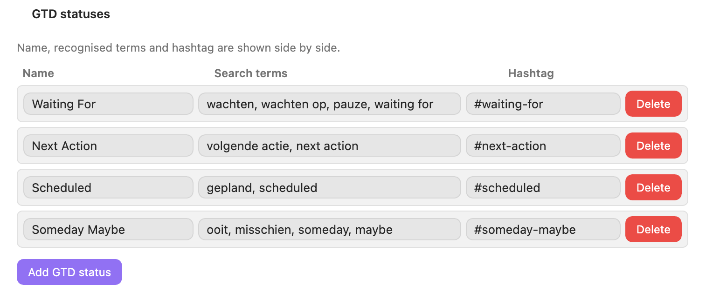
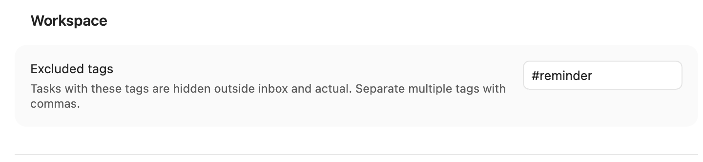

# Tasks NL – Nederlandstalige handleiding

Deze handleiding beschrijft Tasks NL versie 0.9.0 voor Obsidian. De plugin laat je taken in natuurlijke Nederlandse tekst invoeren, bewaart ze als gewone Markdown-taken en toont ze in een GTD-georiënteerde Workspace.
## 1. Algemene werkwijze

Tasks NL gebruikt je Markdown-bestanden als bron. Een taak blijft dus een normale regel zoals:
  
```markdown

- [ ] Call Peter 📅 2026-07-13 🔥 high # Pweb

```

De gebruikelijke werkwijze is:

1. Open **Create or edit task** via het opdrachtenpalet of het lint.
2. Typ de taak in natuurlijke taal.
3. Controleer eventueel de live preview.
4. Sla de taak op in het actieve bestand.
5. Gebruik de Workspace om taken per status, datum, project of persoon te bekijken.
6. Maak periodiek een week- of maandreview.

Tasks NL herkent onder meer datums, prioriteiten, herhaling, projecten, personen en GTD-termen. De exacte herkenning wordt mede bepaald door de definities in de instellingen.

## 2. Instellingen


  Open **Settings → Community plugins → Tasks NL**. Het instellingenscherm is verdeeld in secties.

### General

**Default task title**

De standaardtitel die wordt gebruikt wanneer geen bruikbare titel is ingevoerd.
  
**Keep original task text**

Bewaart de oorspronkelijke invoertekst naast of in de uiteindelijke taak. Schakel dit in wanneer je wilt kunnen terugzien wat je letterlijk hebt getypt.

**Keep completed recurring task**

Laat de voltooide instantie van een herhalende taak staan wanneer de volgende instantie wordt gemaakt. Uitgeschakeld blijft vooral de nieuwe/open instantie relevant.

**Show ribbon icon**

Toont een Tasks NL-knop in het linker lint van Obsidian.

**Show Workspace icon**

Toont een aparte knop voor de Tasks NL Workspace in het linker lint.

**Show status bar item**

Toont Tasks NL in de statusbalk.

### Capture


In deze sectie beheer je de woordenlijsten waarmee natuurlijke invoer wordt geïnterpreteerd.

**GTD definitions**



Koppelt een label en synoniemen aan een hashtag, bijvoorbeeld Waiting For of Someday. Synoniemen zorgen dat verschillende schrijfwijzen dezelfde classificatie opleveren.
  
**Project definitions**


Legt projectnaam, alias en hashtag vast. Een herkend project kan daardoor als consistente hashtag in de taak worden opgeslagen.

**Person definitions**


Legt voornaam, achternaam, alias en hashtag vast. Hiermee kun je personen in natuurlijke tekst herkennen en later in de Workspace filteren.
  
Gebruik unieke aliases en hashtags om dubbelzinnige herkenning te voorkomen.
### Reviews

Tasks NL bevat sjablonen voor onder meer een weekreview en maandreview.

**Automatic creation**

Maakt het betreffende reviewdocument automatisch op de gekozen weekdag.

**Weekday**

Bepaalt de dag voor automatische reviews. Voor een maandreview wordt de laatste geselecteerde weekdag van de maand gebruikt.

**Folder in vault**

De map waarin het reviewbestand wordt opgeslagen. Week- en maandreviews mogen dezelfde map gebruiken.

**Filename format**

Bepaalt de bestandsnaam met Moment-notatie. Letterlijke tekst plaats je tussen vierkante haken.

**Main task**

De hoofdtaak die in het reviewdocument wordt geplaatst. Met `{{FILENAME}}` voeg je de gegenereerde bestandsnaam in.

**Subtasks, one per line**

De standaarddeeltaken van het reviewproces. Iedere regel wordt een aparte Markdown-deeltaak.

**Markdown template**

De volledige inhoud van de reviewnotitie. Hier kun je vaste tekst, koppen en placeholders opnemen.
### Preview

**Show live preview**

Toont tijdens invoer hoe Tasks NL de tekst interpreteert en als Markdown zal opslaan. Dit is nuttig om datum-, prioriteits- en hashtagherkenning te controleren.
### Workspace

**Excluded tags**



Een kommagescheiden lijst hashtags waarvan taken normaal verborgen worden, bijvoorbeeld:
  
```text

#reminder, #birthday, #holiday-idea

```

De knop **Hidden** in de Workspace toont juist de verborgen taken. In de meegeleverde hotfix worden die taken gesorteerd op de eerste overeenkomende uitgesloten hashtag en daarna op titel. Verborgen review-deeltaken worden niet in dit overzicht getoond.
## 3. Nieuwe taak maken


Start de opdracht **Tasks NL: Create or edit task** terwijl de cursor niet op een bestaande taak staat.

1. Typ de taakomschrijving in het invoerveld.
2. Gebruik natuurlijke woorden voor een datum, prioriteit, persoon, project of herhaling.
3. Controleer **Preview** wanneer live preview is ingeschakeld.
4. Kies zo nodig expliciet een vervaldatum via **Due date**.
5. Voeg deeltaken toe, één per regel.
6. Bevestig om de Markdown-taak in het actieve bestand te plaatsen.

Voorbeeld:

```text

Call tomorrow Peter bellen high new website

```

kan worden omgezet naar:

```markdown

- [ ] Peter bellen 📅 2026-07-13 🔥 high #Pweb

```

De precieze uitvoer hangt af van je woordenlijsten en instellingen.

## 4. Een taak bewerken


Plaats de cursor op een bestaande Markdown-taak en start **Create or edit task**.

Het venster leest de bestaande taak in, inclusief titel, datum, prioriteit, herhaling, hashtags en eventuele deeltaken.

- Pas de tekst of expliciete velden aan.
- Controleer de preview.
- Bestaande subtaken verschijnen onder **Existing subtasks**.
- Sla op om de oorspronkelijke taakregel te vervangen.

Bij taken met een bronbestand opent of wijzigt Tasks NL de taak in dat oorspronkelijke Markdown-bestand. Markdown blijft de bron van waarheid; wijzigingen zijn dus ook zonder de plugin leesbaar.

## 5. Workspace


Open de opdracht **Open workspace** of gebruik het Workspace-lintpictogram.

### Bovenbalk

De bovenbalk bevat:
- een knop om een review te maken;
- een knop naar de Tasks NL-instellingen;
- navigatieknoppen naar de hoofdsecties;
- een zoekveld;
- een projectfilter;
- een personenfilter;
- de knop **Hidden**.
### Secties

**Review**
Open reviewtaken met de hashtag `#tasks-nl-review`.
  
**Inbox**
Open taken zonder vervaldatum en zonder hashtags. Dit zijn taken die nog verwerkt of geclassificeerd moeten worden.

**Actual**
Open taken met een vervaldatum tot en met morgen.
  
**This week**
Open taken vanaf overmorgen tot en met zeven dagen vooruit.
  
**7+ days**
Open taken die verder dan zeven dagen in de toekomst liggen.
  
**Waiting For**
Taken met de ingestelde GTD-hashtag of een daarvan afgeleide classificatie.

**Someday**
Taken die via de ingestelde GTD-definitie als Someday zijn gemarkeerd.

Een taak kan in meer dan één relevante sectie voorkomen. Een taak met een datum en Waiting For-status kan bijvoorbeeld zowel in een datumsectie als in Waiting For staan.

### Zoeken en filteren

Het zoekveld filtert de zichtbare taken. Het project- en personenfilter gebruikt de in de instellingen vastgelegde hashtags. Met **Hidden** wissel je naar uitsluitend verborgen taken.
1. taken worden gegroepeerd op de eerste alfabetische uitgesloten hashtag;
2. binnen die hashtag worden ze op titel gesorteerd;
3. taken die alleen door volgorde/structuur verborgen zijn komen na taken met een uitgesloten hashtag;
4. verborgen deeltaken uit de Review-sectie worden niet getoond.

Klik op een taak om de bron te openen of de taak te bewerken. Gebruik het selectievakje om een taak af te ronden.

## 6. Review en het reviewscherm

Klik in de Workspace op het reviewpictogram of start **Create task from template**.

Het reviewscherm toont de beschikbare reviewsjablonen, waaronder week- en maandreview. Na selectie maakt Tasks NL een nieuw Markdown-bestand met:

- de ingestelde bestandsnaam;
- de gekozen doelmap;
- de hoofdtaak;
- de geconfigureerde subtaken;
- de inhoud van het Markdown-sjabloon;
- de voor het sjabloon verzamelde taken.

Reviewtaken worden herkenbaar gemaakt met `#tasks-nl-review` en verschijnen in de aparte Review-sectie van de Workspace. Daardoor blijven ze gescheiden van gewone Inbox-, datum- en GTD-taken.
### Aanbevolen reviewproces

1. Maak de review via het sjabloon.
2. Werk de reviewdeeltaken van boven naar beneden af.
3. Verwerk Inbox-taken.
4. Controleer achterstallige en komende taken.
5. Bekijk Waiting For en Someday.
6. Werk projecten en personen bij.
7. Rond de reviewhoofdtaak af.

Bij gebruik van uitgesloten hashtags blijven onderdrukte review-deeltaken buiten het Hidden-overzicht; zo wordt dat overzicht niet gevuld met interne onderdelen van een review.
## 7. Beschikbare commando’s

Open het Obsidian-opdrachtenpalet met `Ctrl/Cmd + P` en zoek op “Tasks NL”.
### Tasks NL: Open workspace
Opent of activeert de Tasks NL Workspace.
### Tasks NL: Create task from template
Opent de sjabloonkiezer voor onder meer week- en maandreviews.
### Tasks NL: Create or edit task
Maakt een nieuwe taak of bewerkt de taak waarop de cursor staat.

[Ben je blij met deze toepassing, buy me a coffee](https://buymeacoffee.com/joostvanderhulst)

